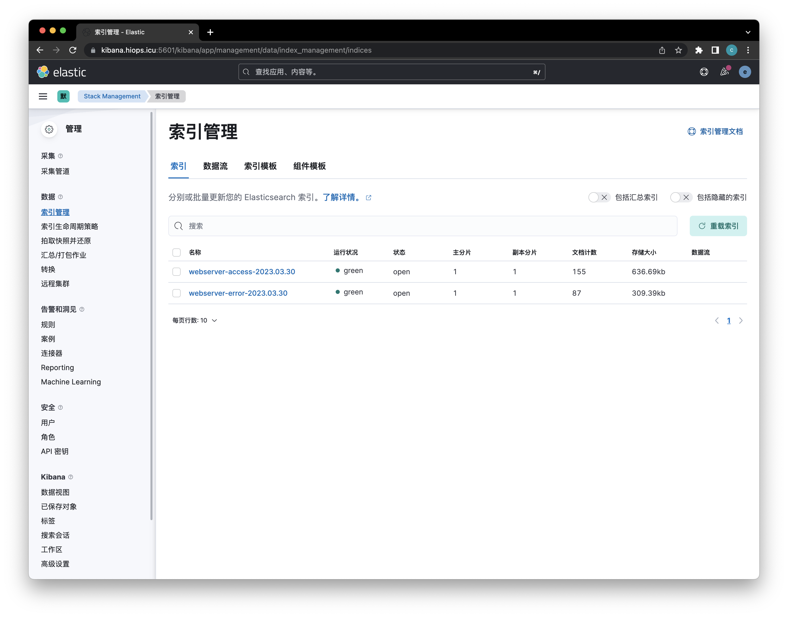
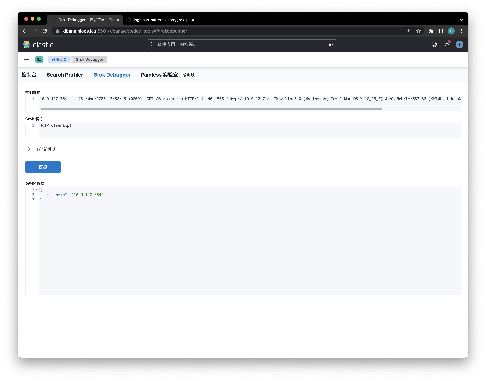
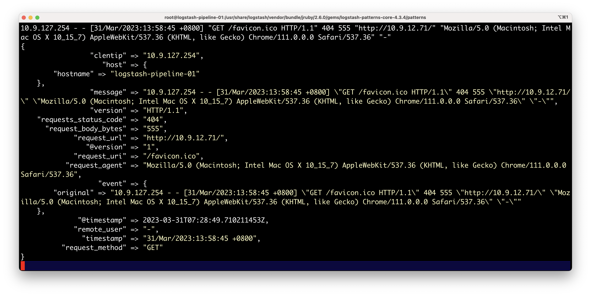
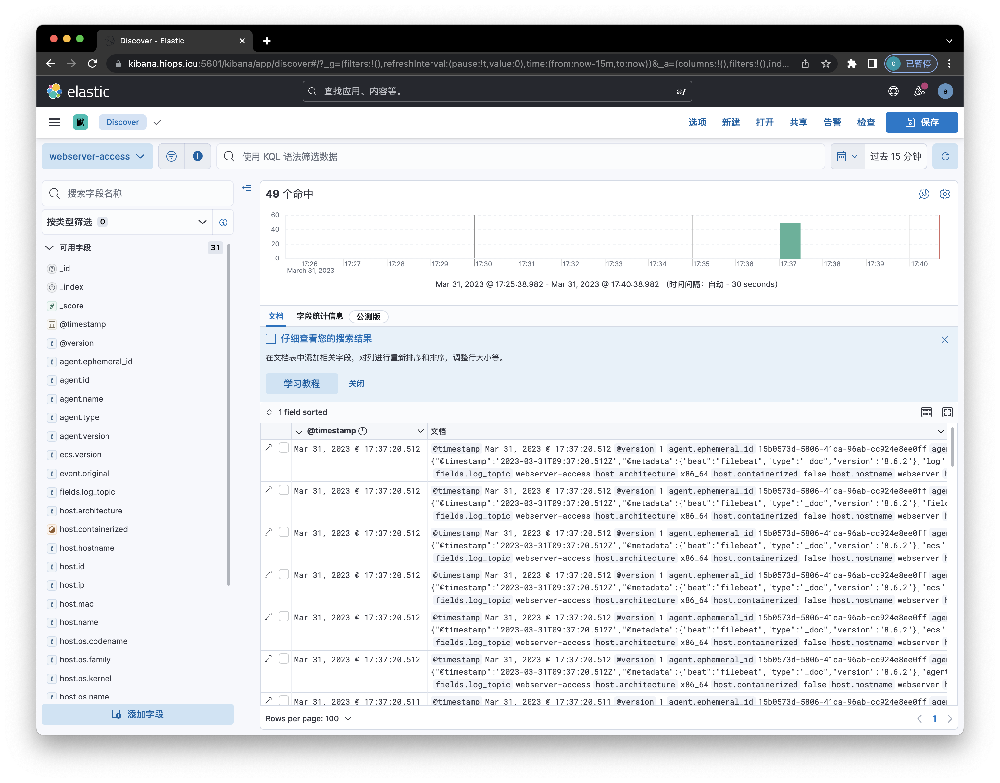

# ELFK 使用汇总

*author: mirschao*

*email: mirschao@gmail.com*

*github: https://github.com/mirschao*

*usage: configure elfk config*

---

**- <u>什么是日志？</u>**

&emsp;&emsp;日志是一种按照时间顺序存储记录的数据, 它记录了什么时间发生了什么事情, 提供精确的系统记录, 根据日志信息可以定位到错误详情和根源. 按照APM概念的定义, 日志的特点是描述一些离散的事件; 日志是按照错误级别分级的, 常见的错误级别有 FATAL、WATNING、NOTICE、DEBUG、TRACE 5种类型; 通常我们会在项目里面定义一个日志打印级别, 高于这个级别的错误日志会数据落盘;


**- <u>什么时候记录日志？以及日志的价值</u>**

&emsp;&emsp;在大型网站系统架构里面, 日志是其中的重要功能组成部分. 它可以记录下系统所产生的所有行为, 并按照某种规范表达出来. 我们可以使用日志系统所记录的信息为系统进行排错、优化性能. 通过统计用户行为日志, 帮助产品运营同学做业务决策. 在安全领域, 日志可以反应出很多的安全攻击行为, 比如登录错误、异常访问等. 日志能告诉你很多关于网络中所发生事件的信息, 包括性能信息、故障检测和入侵检测. 还可以为审计进行审计跟踪, 日志的价值是显而易见的


**- <u>为什么运维同学要建立日志平台？</u>**

&emsp;&emsp;微服务发展迅猛的今天, 松耦合的设计层出不穷. 为简化服务服务带来了极大的便利. 业务方向分工明确, 研发同学只需要关心自己模块的版本迭代上线就好. 随着整个业务架构的扩大, 服务实例的数量迎来了爆炸性的增长, 往往带来以下问题：

- 由不同团队开发, 使用不同的编程语言, 日志格式不规范统一
- 微服务迭代速度快, 日志漏记、级别使用错误、难以提取有效信息
- 容器实例分布在成千上万台服务器上, 横跨多个数据中心, 异构部署, 难以串联请求链路

没有工具的情况下, 需要登录服务实例, 查看原始日志, 在日志文件中通过grep、awk方式获得自己想要的信息. 但在规模较大的场景中, 此方法效率低下, 面临问题包括日志量太大不易归档、文本搜索太慢、不方便多维度查询. 这时候需要更加高效的运维工具来代替人工访问日志. 常见解决思路是建立集中式日志收集系统, 将所有节点上的日志统一收集, 管理, 访问

同时我们希望通过原始日志去理解系统行为, 这需要建设具备性能分析, 问题定位的能力的工具平台. 它能够支持：

- 在故障发生前, 分析风险和系统瓶颈
- 在故障发生时, 及时通知, 快速定位解决问题
- 在故障发生后, 有历史数据迅速复盘

通过建设具备日志即时收集、分析、存储等能力的工具平台. 用户可以快速高效地进行问题诊断、系统运维、流量稳定性监控、业务数据分析等操作. 


**- <u>日志和ELK什么关系？</u>**

&emsp;&emsp;日志是系统运行时发生的一个个事件的记录. Logging的典型特征就是它和孤立的事件(Event)强关联, 一个事件的产生所以导致了一条日志的产生. 举个例子就是一个网络请求是一个事件, 它被云端接到后Nginx产生了一个访问log. 大量的不同外部事件间基本是离散的, 比如多个用户访问云端业务时产生的5个事件间没有必然的关系, 所以在一个服务节点的角度上看这些事件产生的日志间也是离散的. 

关于日志管理平台, 相信很多同学听说过最多的就是ELK(elastic stack), ELK是三款软件的简称, 分别是Elasticsearch、 Logstash、Kibana组成. 在APM体系中, 它可以实现关键字的分布式搜索和日志分析, 能够快速定位到我们想要的日志, 通过可视化平台的展示, 能够从多个维度来对日志进行细化跟踪. 

- **Elasticsearch**基于java, 是个开源分布式搜索引擎, 它提供了一个分布式多用户能力的全文搜索引擎, 基于RESTful web接口. 是当前流行的企业级搜索引擎. 设计用于云计算中, 能够达到实时搜索, 稳定, 可靠, 快速, 安装使用方便. 它的特点有：分布式, 零配置, 自动发现, 索引自动分片, 索引副本机制, restful风格接口, 多数据源, 自动搜索负载等

- **Kibana**基于nodejs, 是一款开源的数据分析和可视化平台, 它是Elastic Stack成员之一, 设计用于和Elasticsearch协作. 您可以使用Kibana对Elasticsearch索引中的数据进行搜索、查看、交互操作. 您可以很方便的利用图表、表格及地图对数据进行多元化的分析和呈现

- **Logstash**基于java, 是一个开源的用于收集,分析和存储日志的工具, 能够同时从多个来源采集数据, 转换数据, 然后将数据发送到最喜欢的存储库中(我们的存储库当然是ElasticSearch)

ELK中的L理解成Logging Agent比较合适. Elasticsearch和Kibana是存储、检索和分析log的标准方案. 在高负载的ELK平台迭代实践中, 常常采用一些优化策略. 比如：ElasticSearch 做冷热数据分离, 历史索引数据关闭；Filebeat更加轻量, 对资源消耗更少, 替代Logstash作为数据收集引擎；增加消息队列做数据缓冲, 通过解耦处理过程实现削峰平谷, 帮助平台顶住突发的访问压力. 

ELK的缺点也是明显的, 部署这样一套日志分析系统, 不论是存储还是分析所需要占用的机器成本是挺大的. 业务日志是时时打印的, 大规模的在线服务一天日志量可能达到TB级别, 如果采用ELK平台, 在保证关键日志信息入库的同时, 有针对性的对所需日志文件进行采集和过滤是必不可少的, 所以在logstash中对日志进行过滤也是很有必要的

----

[TOC]

---

### 1. Filebeat 配置采集规则

&emsp;&emsp;Filebeat在业务服务器或k8s的node节点中有可能采集的数据源并不止一个, 所以往往需要配置多个数据源(input), 这时向kafka中创建topic就成了问题, 每个数据源所创建的topic是不一样的, 如何让filebeat所创建的topic与filebeat所采集的数据源一对一就成了必要解决的问题, 对于该类问题可以采用 field 字段进行解决下面为详细的配置文件

```yaml
filebeat.input:
- type: log
  tail_files: true
  backoff: "1s"
  id: nginx-logstream-access
  enabled: true
  paths:
    - /var/log/nginx/access.log
  fields:
    log_topic: "webserver-access"
- type: log
  tail_files: true
  backoff: "1s"
  id: nginx-logstream-error
  enabled: true
  paths:
    - /var/log/nginx/error.log
  fields:
    log_topic: "webserver-error"
filebeat.config.modules:
  path: ${path.config}/modules.d/*.yml
  reload.enabled: false
setup.template.settings:
  index.number_of_shards: 1
setup.kibana:
output:
  kafka:
    hosts: ["10.9.12.62:9092", "10.9.12.63:9092"]
    topic: '%{[fields.log_topic]}'
      partition.round_robin:
    reachable_only: false
    required_acks: 1
    compression: gzip
    max_message_bytes: 1000000
processors:
  - add_host_metadata:
      when.not.contains.tags: forwarded
  - add_cloud_metadata: ~
  - add_docker_metadata: ~
  - add_kubernetes_metadata: ~
```

&emsp;&emsp;对于上方的filebeat配置完成后在logstash中要对topic进行识别, 才能将对应的日志数据创建在ES的索引中, 从而在kibana中显示出对应topic的日志数据; 这里logstash的output板块采用filebeat在传输到Kafka中的fileds字段中的log_topic变量来进行的设定

```json
input {
  kafka {
    bootstrap_servers => "10.9.12.62:9092,10.9.12.63:9092"
    auto_offset_reset => "latest"
    group_id => "webserver"
    consumer_threads => 5
    decorate_events => true
    topics_pattern => "webserver-.*"
    codec => "json"
  }
}

output {
  elasticsearch {
    hosts => ["http://10.9.12.51:9200", "http://10.9.12.52:9200", "http://10.9.12.53:9200"]
    user => "elastic"
    password => "Qfclass123!!"
    index => "%{[fields][log_topic]}-%{+YYYY.MM.dd}"
  }
}
```



### 2. Filebeat 批量部署及配置

&emsp;&emsp;在正常的业务场景中, 由于上线新的模块或者服务就需要对filebeat的配置文件进行修改或者创建, 以及对于新机器中要进行部署和安装filebeat; 基于以上需求对于配置文件的修改和创建可以采用两种方式: `filebeat配置修改动作集成到运维平台中`、`ansible使用jinjia2模版进行替换`; 对于需要新部署的业务机器采集日志可以采用`ansible部署并配置filebeat`

需求a: ansible使用jinjia2修改配置文件

```yaml
#> hosts文件:
[businessName]
10.9.12.[31:39]
[businessName:vars]
bname = "shequ"

#> playbook文件:
- hosts: businessName
  tasks:
    - name: insert new log source to old filebeat configure file.
      lineinfile:
        dest: '/path/to/dir/filebeat.yml'
        insertbefore: 'filebeat.config.modules'
        line: "{{ item }}"
      with_items:
        - '- type: log'
        - '  tail_files: true'
        - '  backoff: 1s'
        - '  id: logstream-{{ bname }}'
        - '  enabled: true'
        - '  paths:'
        - '    - /path/to/dir/xxx.log'
        - '  fields:'
        - '    log_topic: {{ bname }}'
      notify: 'restart filebeat service'
  handlers:
    - name: restart filebeat service
      service:
        name: filebeat
        state: restarted
      listen: 'restart filebeat service'
```


需求b: ansible部署并配置filebeat在新业务机器中

```yaml
#> 模版文件:
$ vim filebeat.yml
[elastic-8.x]
name=Elastic repository for 8.x packages
baseurl=https://artifacts.elastic.co/packages/8.x/yum
gpgcheck=1
gpgkey=https://artifacts.elastic.co/GPG-KEY-elasticsearch
enabled=1
autorefresh=1
type=rpm-md

$ vim filebeat.j2
filebeat.inputs:
- type: log
  tail_files: true
  backoff: "1s"
  id: {{ logstream-id }}
  enabled: true
  paths:
    - {{ logfile-path }}
  fields:
    log_topic: "{{ topic-name }}"
filebeat.config.modules:
  path: ${path.config}/modules.d/*.yml
  reload.enabled: false
setup.template.settings:
  index.number_of_shards: 1
setup.kibana:
output:
  kafka:
    hosts: ["{{ kafka-pipeline-a }}:9092", "{{ kafka-pipeline-b }}:9092"]
    topic: '%{[fields.log_topic]}'
processors:
  - add_host_metadata:
      when.not.contains.tags: forwarded
  - add_cloud_metadata: ~
  - add_docker_metadata: ~
  - add_kubernetes_metadata: ~

#> hosts文件:
[newbusiness]
10.9.12.[31:39]
[newbusiness:vars]
newbusiness_name = "luntan"

#> playbook文件:
- hosts: newbusiness
  vars:
    - logstream-id: "business-name-id"
    - logfile-path: "/var/log/nginx/access.log"
    - topic-name: "business-name"
    - kafka-pipeline-a: "10.9.12.62"
    - kafka-pipeline-b: "10.9.12.63"
  tasks:
    - name: configure filebeat install repo.
      copy:
        src: filebeat.yml
        dest: /etc/yum.repos.d/filebeat.yml
    - name: install filebeat process service.
      yum:
        name: filebeat
        state: latest
    - name: configure filebeat configure file.
      template:
        src: filebeat.j2
        dest: /etc/filebeat/filebeat.yml
      notify: "enable now filebeat"
  handlers:
    - name: enable now filebeat
      service:
        name: filebeat
        state: started
        enabled: True
      listen: "enable now filebeat"
```


### 3. Logstash 的过滤管道

&emsp;&emsp;对于日志收集而言, 并不是所有的日志数据均是被我们需要的, 有些不必要的字段可以被我们使用logstash的filter模块过滤掉, 从而减少对ES的存储压力, 进而也能将日志存储成我们想要的模式和结构; 进而在处理日志的过程中更加得心应手; 

&emsp;&emsp;logstash的filter模块中可以使用munte增加字段到数据中, 也可以使用grok对日志数据进行结构化过滤进而提取出来有价值的数据, 从而输出到ES中进行存储; 对于logstash而言Grok是将非结构化日志数据解析为结构化和可查询数据的好方法, 默认情况下，Logstash 附带大约 120 种模式。可以在这里找到它们： https://github.com/logstash-plugins/logstash-patterns-core/tree/master/patterns

```json
#> nginx access日志文件单条内容如下:
10.9.127.254 - - [31/Mar/2023:13:58:45 +0800] "GET /favicon.ico HTTP/1.1" 404 555 "http://10.9.12.71/" "Mozilla/5.0 (Macintosh; Intel Mac OS X 10_15_7) AppleWebKit/537.36 (KHTML, like Gecko) Chrome/111.0.0.0 Safari/537.36" "-"
```

打开 grok debugger 界面, 对上述日志文件进行模式匹配并命名新的字段名称; https://kibana.hiops.icu:5601/kibana/app/dev_tools#/grokdebugger 注意更换URL中的二级域名;

根据上方生成的各个匹配模式即可构成如下的logstash配置文件; filter中使用grok进行过滤即可

在 `/usr/share/logstash/vendor/bundle/jruby/2.6.0/gems/logstash-patterns-core-4.3.4/patterns` 中创建 `nginx` 文件, 并在其中增加如下正则表达式:

```reStructuredText
ACCESS %{IP:clentip} - (%{USERNAME:remote_user}|-) \[%{HTTPDATE:timestamp}\] "%{WORD:request_method} %{URIPATHPARAM:request_uri} %{NOTSPACE:version}" %{NUMBER:requests_status_code} %{NUMBER:request_body_bytes} "%{URI:request_url}" "%{GREEDYDATA:request_agent}" "%{IP:request_rewrite_to}"
```

在 `/etc/logstash/conf.d/test-grok.conf` 中增加以下配置, 用于测试

```json
#> 准备logstash的测试配置文件, 用于测试解析日志数据
input {
  stdin {}
}

filter {
  grok {
    patterns => "/usr/share/logstash/vendor/bundle/jruby/2.6.0/gems/logstash-patterns-core-4.3.4/patterns"
    match => { "message" => "%{NGINXACCESS}" }
  }
}

output {
  stdout {}
}
```

执行 `/usr/share/logstash/bin/logstash -f /etc/logstash/conf.d/test-grok.conf` 在启动成功后将下方的日志数据放入到标准输入中, 查看是否能生成对应的字段数据; 以下数据为标准nginx日志文件数据

```nginx
10.9.127.254 - - [31/Mar/2023:13:58:45 +0800] "GET /favicon.ico HTTP/1.1" 404 555 "http://10.9.12.71/" "Mozilla/5.0 (Macintosh; Intel Mac OS X 10_15_7) AppleWebKit/537.36 (KHTML, like Gecko) Chrome/111.0.0.0 Safari/537.36" "-"
```



将上述的grok规则放入到生产环境的配置文件中, 即可采集nginx日志, 并对其进行结构化展示了, 从而在kibana界面中的Discover即可查询到对应的字段信息了; 对于其他的中间件or自建服务的日志可仿照上述规则进行设定, 只要把握住正则匹配的模式即可对任何服务进行日志结构化匹配了;


### 4. kibana创建日志图型

&emsp;&emsp;kibana在ELK中绝对是展示日志的神器, 精美的UI界面中可以让我们时时的查看日志的变化趋势, 同时也提供给我们一套创建聚合图型的Dashboard从而帮助我们节省时间, 直达要查看的指标界面中, 从而帮助我们运维工程师定位问题和分析问题;

- 日常错误排查时, 对于查看日志的需求是在 `Discover` 中选择对应业务的索引即可查看到相关的日志

  

- 虽然discover中可以体现出所有的指标并且具备很多操作性, 但业务紧急故障的时候还是需要快速查看到对应的指标信息的, 并且对于日常统计网站、接口等在线信息时也是需要大量的手工操作才能在discover中体现出对应的指标信息, 在kibana中设定了dashboard界面来对单一业务中的相关指标进行图型聚合, 从而在每个业务的dashboard中去直接体现指标数据的变化

  
