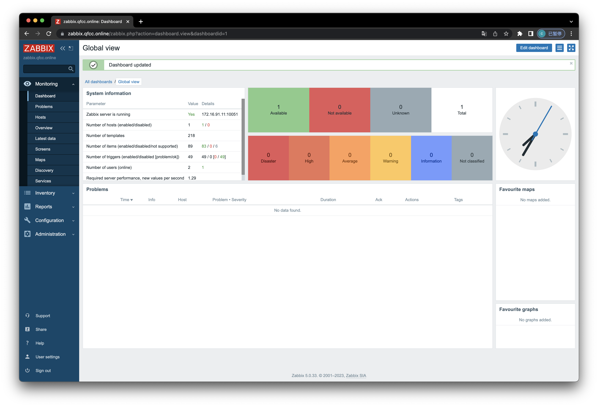

# Zabbix 5.0 课程笔记

*author: mirschao*

*email: mirschao@gmail.com*

*github: https://github.com/mirschao*

---


### 1. Zabbix概述

&emsp;&emsp;Zabbix 是由 Alexei Vladishev 创建, 目前是由 Zabbix SIA 在持续开发和提供支持. Zabbix 是一种企业级的分布式开源监控解决方案. Zabbix 是一款能够监控众多网络参数和服务器的健康度和完整性的软件. Zabbix 使用灵活的通知机制, 允许用户为几乎任何事件配置基于邮件的警报. 这样可以快速相应服务器问题. 

&emsp;&emsp;Zabbix 基于存储的数据提供出色的报告和数据可视化. 这些功能使得 Zabbix 成为容量规划的理想选择. Zabbix 支持轮询和被动捕获. 所有的 Zabbix 报告、统计信息和配置参数都可以通过基于 Web 的前端页面进行访问. 基于 Web 的前端页面确保您的网络状态和服务器健康状况可以从任何地方进行评估. 在经过适当的配置后, Zabbix 可以在监控 IT 基础设施方面发挥重要作用. 无论是对于拥有少量服务器的小型组织, 还是拥有大量服务器的大型公司而言, 同样适用. Zabbix 是免费的. Zabbix 是根据 GPL 通用公共许可证的第二版编写和分发的. 这意味着它的源代码是免费分发的, 并且可供公共使用


### 2. Zabbix功能介绍

**[数据采集](https://www.zabbix.com/documentation/5.0/zh/manual/config/items)**

- 可用性和性能采集；
- 支持 SNMP（包括主动轮询和被动捕获）、IPMI、JMX、VMware 监控；
- 自定义检查；
- 按照自定义的时间间隔采集需要的数据；
- 通过 Server/Proxy 和 Agents 来执行数据采集. 

**[灵活的阈值定义](https://www.zabbix.com/documentation/5.0/zh/manual/config/triggers)**

- 您可以定义非常灵活的告警阈值, 称之为触发器, 触发器从后端数据库获得参考值. 

**[高度可配置化的告警](https://www.zabbix.com/documentation/5.0/zh/manual/config/notifications)**

- 可以根据递增计划、接收者、媒介类型自定义发送告警通知；
- 使用宏变量可以使告警通知变得更加高效有益；
- 自动动作包含远程命令. 

**[实时图形](https://www.zabbix.com/documentation/5.0/zh/manual/config/visualization/graphs/simple)**

- 使用内置图形功能可实以将监控项绘制成图形. 

**[Web 监控功能](https://www.zabbix.com/documentation/5.0/zh/manual/web_monitoring)**

- Zabbix 可以追踪模拟鼠标在 Web 网站上的点击操作, 来检查 Web 网站的功能和响应时间. 

**[丰富的可视化选项](https://www.zabbix.com/documentation/5.0/zh/manual/config/visualization)**

- 能够创建可以将多个监控项组合到单个视图中的自定义图形；
- 网络拓扑图；
- 以仪表盘样式展示自定义聚合图形和幻灯片演示；
- 报表；
- 监控资源的高层次（业务）视图. 

**[历史数据存储](https://www.zabbix.com/documentation/5.0/zh/manual/installation/requirements#database-size)**

- 存储在数据库中的数据；
- 可配置的历史数据；
- 内置数据管理机制（housekeeping）. 

**[配置简单](https://www.zabbix.com/documentation/5.0/zh/manual/config/hosts)**

- 将被监控设备添加为主机；
- 主机一旦添加到数据库中, 就会采集主机数据用于监控；
- 将模板用于监控设备. 

**[套用模板](https://www.zabbix.com/documentation/5.0/zh/manual/config/templates)**

- 在模板中分组检查；
- 模板可以关联其他模板, 获得继承. 

**[网络发现](https://www.zabbix.com/documentation/5.0/zh/manual/discovery)**

- 自动发现网络设备；
- Zabbix Agent 发现设备后自动注册；
- 自动发现文件系统、网络接口和 SNMP OIDs 值. 

**[快捷的 Web 界面](https://www.zabbix.com/documentation/5.0/zh/manual/web_interface)**

- 基于 PHP 的 Web 前端；
- 可以从任何地方访问；
- 您可以定制自己的操作方式；
- 审计日志. 

**[Zabbix API](https://www.zabbix.com/documentation/5.0/zh/manual/api)**

- Zabbix API 为 Zabbix 提供可编程接口, 用于批量操作、第三方软件集成和其他用途. 

**[权限管理系统](https://www.zabbix.com/documentation/5.0/zh/manual/config/users_and_usergroups)**

- 安全的用户身份验证；
- 将特定用户限制于访问特定的视图. 

**[功能强大且易于扩展的 Zabbix Agent](https://www.zabbix.com/documentation/5.0/zh/manual/concepts/agent)**

- 部署于被监控对象上
- 完美支持 Linux 和 Windows 

**[二进制守护进程](https://www.zabbix.com/documentation/5.0/zh/manual/concepts/server)**

- 为了更好的性能和更少的内存占用, 采用 C 语言编写；
- 便于移植. 

**[适应更复杂的环境](https://www.zabbix.com/documentation/5.0/zh/manual/distributed_monitoring)**

- 使用 Zabbix Proxy 代理, 可以轻松实现分布式远程监控. 


### 3. Zabbix架构解析

##### Server

[Zabbix server](https://www.zabbix.com/documentation/5.0/zh/manual/concepts/server) 是 Zabbix agent 向其报告可用性、系统完整性信息和统计信息的核心组件. 是存储所有配置信息、统计信息和操作信息的核心存储库

##### 数据库

所有配置信息以及 Zabbix 收集到的数据都被存储在数据库中

##### Web 界面

为了从任何地方和任何平台轻松访问 Zabbix , 我们提供了基于 web 的界面. 该界面是 Zabbix server 的一部分, 通常（但不一定）和 Zabbix server 运行在同一台物理机器上

##### Proxy

[Zabbix proxy](https://www.zabbix.com/documentation/5.0/zh/manual/concepts/proxy) 可以替 Zabbix server 收集性能和可用性数据. Zabbix proxy 是 Zabbix 环境部署的可选部分；然而, 它对于单个 Zabbix server 负载的分担是非常有益的

##### Agent

[Zabbix agents](https://www.zabbix.com/documentation/5.0/zh/manual/concepts/agent) 部署在被监控目标上, 用于主动监控本地资源和应用程序, 并将收集的数据发送给 Zabbix server

#### 数据流

此外, 重要的是, 需要回过头来了解下 Zabbix 内部的整体数据流. 首先, 为了创建一个采集数据的监控项, 您就必须先创建主机. 其次, 必须有一个监控项来创建触发器. 最后, 您必须有一个触发器来创建一个动作, 这几个点构成了一个完整的数据流. 因此, 如果您想要收到 CPU load it too high on *Server X* 的告警, 您必须首先为 *Server X* 创建一个主机条目, 其次创建一个用于监视其 CPU 的监控项, 最后创建一个触发器, 用来触发 CPU is too high 这个动作, 并将其发送到您的邮箱里. 虽然这些步骤看起来很繁琐, 但是使用模板的话, 其实并不复杂. 也正是由于这种设计, 使得 Zabbix 的配置变得更加灵活易用


#### 4. Zabbix术语解析

***[主机（host）](https://www.zabbix.com/documentation/5.0/zh/manual/config/hosts)\***

\- *你想要监控的联网设备, 有IP/DNS. *

***[主机组（host group)](https://www.zabbix.com/documentation/5.0/zh/manual/config/hosts)\***

\- *主机的逻辑组；可能包含主机和模板. 一个主机组里的主机和模板之间并没有任何直接的关联. 通常在给不同用户组的主机分配权限时候使用主机组. *

***[监控项（item）](https://www.zabbix.com/documentation/5.0/zh/manual/config/items)\***

\- *你想要接收的主机的特定数据, 一个度量/指标数据. *

***[值预处理（value preprocessing）](https://www.zabbix.com/documentation/5.0/zh/manual/config/items/item#item-value-preprocessing)\***

\- *转化/预处理接收到的指标数据* 存入数据库之前. 

***[触发器（trigger）](https://www.zabbix.com/documentation/5.0/zh/manual/config/triggers)\***

\- *一个被用于定义问题阈值和“评估”监控项接收到的数据的逻辑表达式*

当接收到的数据高于阈值时, 触发器从"OK"变成"Problem"状态. 当接收到的数据低于阈值时, 触发器保留/返回"OK"的状态. 

***[事件（event）](https://www.zabbix.com/documentation/5.0/zh/manual/config/events)\***

\- *一次发生的需要注意的事情, 例如触发器状态改变、发现/监控代理自动注册*

***[事件标签（event tag）](https://www.zabbix.com/documentation/5.0/zh/manual/config/triggers/event_tags)\***

\- *提前设置的事件标记*可以被用于事件关联, 权限细化设置等. 

***[事件关联（event correlation）](https://www.zabbix.com/documentation/5.0/zh/manual/config/event_correlation)\***

\- *自动灵活的、精确的关联问题和解决方案*

比如说, 你可以定义触发器A告警的异常可以由触发器B解决, 触发器B可能采用完全不同的数据采集方式. 

***[异常（problems）](https://www.zabbix.com/documentation/5.0/zh/manual/web_interface/frontend_sections/monitoring/problems)\*** - *一个处在"异常"状态的触发器*

***[异常更新（problem update）](https://www.zabbix.com/documentation/5.0/zh/manual/acknowledges#updating-problems)\***

\- *Zabbix提供的问题管理选项, 例如添加评论、确认异常、改变问题级别或者手动关闭等. *

***[动作（action）](https://www.zabbix.com/documentation/5.0/zh/manual/config/notifications/action)\***

\- *预先定义的应对事件的操作*

一个动作由操作(例如发出通知)和条件(*什么时间*进行操作)组成

***[升级（escalation）](https://www.zabbix.com/documentation/5.0/zh/manual/config/notifications/action/escalations)\***

\- *一个在动作内执行操作的自定义方式; 发送通知/执行远程命令的顺序安排. *

***[媒介（media）](https://www.zabbix.com/documentation/5.0/zh/manual/config/notifications/media)\***

\- *发送告警通知的方式；传送途径*

***[通知（notification）](https://www.zabbix.com/documentation/5.0/zh/manual/config/notifications/action/operation/message)\***

\- *关于事件的信心, 将通过选设定的媒介途径发送给用户. *

***[远程命令（remote command）](https://www.zabbix.com/documentation/5.0/zh/manual/config/notifications/action/operation/remote_command)\***

\- *一个预定义好的, 满足特定条件的情况下, 可以在被监控主机上自动执行的命令. *

***[模版（template）](https://www.zabbix.com/documentation/5.0/zh/manual/config/templates)\***

\- *一组可以被应用到一个或多个主机上的实体（监控项, 触发器, 图形, 聚合图形, 应用, LLD, Web场景）的集合*

模版的应用使得主机上的监控任务部署快捷方便；也可以使监控任务的批量修改更加简单. 模版是直接关联到每台单独的主机上. 

***[应用（application）](https://www.zabbix.com/documentation/5.0/zh/manual/config/items/applications)\***

\- *一组监控项组成的逻辑分组*

***[Web场景（web scenario）](https://www.zabbix.com/documentation/5.0/zh/manual/web_monitoring)\***

\- *检查网站可浏览性的一个或多个HTTP请求*

***[前端（frontend)](https://www.zabbix.com/documentation/5.0/zh/manual/introduction/overview#architecture)\***

\- *Zabbix提供的web界面*

***[Zabbix API](https://www.zabbix.com/documentation/5.0/zh/manual/api)\***

\- *Zabbix API允许用户使用JSON RPC协议来创建、更新和获取Zabbix对象（如主机、监控项、图形和其他）信息或者执行任何其他的自定义的任务*

***[Zabbix server](https://www.zabbix.com/documentation/5.0/zh/manual/concepts/server)\***

\- *Zabbix监控的核心程序, 主要功能是与Zabbix proxies和Agents进行交互、触发器计算、发送告警通知；并将数据集中保存等*

***[Zabbix agent](https://www.zabbix.com/documentation/5.0/zh/manual/concepts/agent)\***

\- *部署在监控对象上的, 能够主动监控本地资源和应用的程序*

***[Zabbix proxy](https://www.zabbix.com/documentation/5.0/zh/manual/concepts/proxy)\***

\- *一个帮助Zabbix Server收集数据, 分担Zabbix Server的负载的程序*


### 5. Zabbix部署方案

##### a. Install Zabbix repository

```bash
# rpm -Uvh https://repo.zabbix.com/zabbix/5.0/rhel/7/x86_64/zabbix-release-5.0-1.el7.noarch.rpm

# yum clean all
```

##### b. 安装Zabbix server, Web前端, agent

```bash
# yum install zabbix-server-mysql zabbix-agent
```

##### c. Install Zabbix frontend

```bash
# yum install centos-release-scl
```

编辑配置文件 /etc/yum.repos.d/zabbix.repo and enable zabbix-frontend repository.

```bash
[zabbix-frontend]
...
enabled=1
...
```

Install Zabbix frontend packages.

```bash
# yum install zabbix-web-mysql-scl zabbix-nginx-conf-scl
```

##### d. 创建初始数据库

```bash
# rpm -ivh https://dev.mysql.com/get/mysql80-community-release-el7-7.noarch.rpm
# yum -y install mysql-community-server

# mysql -uroot -p
password
mysql> create database zabbix character set utf8 collate utf8_bin;
mysql> create user zabbix@localhost identified with mysql_native_password by 'password';
mysql> grant all privileges on zabbix.* to zabbix@localhost;
mysql> set global log_bin_trust_function_creators = 1;
mysql> quit;
```

导入初始架构和数据, 系统将提示您输入新创建的密码

```bash
# zcat /usr/share/doc/zabbix-server-mysql*/create.sql.gz | mysql -uzabbix -p zabbix

# mysql -uroot -p
password
mysql> set global log_bin_trust_function_creators = 0;
mysql> quit;
```

##### e. 为Zabbix server配置数据库

编辑配置文件 /etc/zabbix/zabbix_server.conf

```bash
DBPassword=password
```

##### f. 为Zabbix前端配置PHP

编辑配置文件 /etc/opt/rh/rh-nginx116/nginx/conf.d/zabbix.conf uncomment and set 'listen' and 'server_name' directives.

```nginx
server {
  listen      80;
  server_name zabbix.hiops.icu;
  
  location / {
    rewrite ^(.*)$ https://zabbix.hiops.icu$1 permanent;
  }
}

server {
  listen      443 ssl;
  server_name zabbix.hiops.icu;
  
  ssl_certificate     www.example.com.crt; # 证书由letsencrypt自行生成
  ssl_certificate_key www.example.com.key;
  ssl_protocols       TLSv1 TLSv1.1 TLSv1.2 TLSv1.3;
  ssl_ciphers         HIGH:!aNULL:!MD5;
  
  ......
  ......
  ......
}
```

编辑配置文件 /etc/opt/rh/rh-php72/php-fpm.d/zabbix.conf add nginx to listen.acl_users directive.

```bash
listen.acl_users = apache,nginx
; php_value[date.timezone] = Europe/Riga -> php_value[date.timezone] = Asia/Shanghai
```

##### g. 启动Zabbix server和agent进程

启动Zabbix server和agent进程, 并为它们设置开机自启：

```bash
# systemctl enable --now zabbix-server zabbix-agent rh-nginx116-nginx rh-php72-php-fpm
```

访问 域名 进入zabbix设置界面, 管理员账号 Admin 密码: zabbix;



**f. 部署agent端** (针对被监控主机)

```bash
# rpm -Uvh https://repo.zabbix.com/zabbix/5.0/rhel/7/x86_64/zabbix-release-5.0-1.el7.noarch.rpm

# yum -y install zabbix-agent
# egrep -v "(^$|^#)" /etc/zabbix/zabbix_agentd.conf
PidFile=/var/run/zabbix/zabbix_agentd.pid
LogFile=/var/log/zabbix/zabbix_agentd.log
LogFileSize=0
Server=172.16.91.11
ServerActive=172.16.91.11
Hostname=zabbix-agent-a
Include=/etc/zabbix/zabbix_agentd.d/*.conf

# systemctl enable --now zabbix-agent
```

Zabbix-server中手动添加主机, 参考 `operators/manual_add_agent_host.md` 如果Markdown文档失效可查看pdf文件


```bash
# rpm -Uvh https://repo.zabbix.com/zabbix/5.0/rhel/7/x86_64/zabbix-release-5.0-1.el7.noarch.rpm

# yum -y install zabbix-agent
# egrep -v "(^$|^#)" /etc/zabbix/zabbix_agentd.conf
PidFile=/var/run/zabbix/zabbix_agentd.pid
LogFile=/var/log/zabbix/zabbix_agentd.log
LogFileSize=0
Server=172.16.91.11
ServerActive=172.16.91.11
HostMetadataItem=system.uname
Include=/etc/zabbix/zabbix_agentd.d/*.conf

# systemctl enable --now zabbix-agent
```

zabbix-server设置自动注册主机, 参考 `operators/auto_add_agent_host.md` 如果Markdown文档失效可查看pdf文件


```yaml
---
- hosts: zabbix-agents
  vars:
    - zabbix_server_ipaddress: "172.16.91.11"
  tasks:
    - name: download zabbix install repo rpm package.
      get_url:
        url: https://repo.zabbix.com/zabbix/....../zabbix-release-5.0-1.el7.noarch.rpm
        dest: /opt
    - name: deploy zabbix install repo rpm package.
      yum:
        name: /opt/zabbix-release-5.0-1.el7.noarch.rpm
        state: present
    - name: installer zabbix-agent package.
      yum:
        name: zabbix-agent
        state: latest
    - name: transfer zabbix-agent.conf configfile.
      template:
        src: zabbix_agent.conf.j2
        dest: /etc/zabbix/zabbix_agentd.conf
      notify:
        - enable now zabbix-agent
  handlers:
    - name: enable now zabbix-agent
      service:
        name: zabbix-agent
        state: started
        enabled: True
```

```jinja2
PidFile=/var/run/zabbix/zabbix_agentd.pid
LogFile=/var/log/zabbix/zabbix_agentd.log
LogFileSize=0
Server={{ zabbix_server_ipaddress }}
ServerActive={{ zabbix_server_ipaddress }}
HostMetadataItem=system.uname
Include=/etc/zabbix/zabbix_agentd.d/*.conf
```

```ini
[zabbix-agents]
172.16.91.[2:254]
[zabbix-agents:vars]
ansible_ssh_user=root
ansible_ssh_pass=password #不推荐使用
ansible_ssh_private_key_file=/path/to/your/.ssh/id_rsa # 私钥
```

执行 `ansible-playbook -i hosts main.yml` 即可将目标主机安装好 zabbix-agent, 配合server端做好的自动注册, 每启动一台 zabbix-agent 即可注册到server平台


### 6. Zabbix监控配置

&emsp;&emsp;对于日常运维过程中, 针对于前端或者后端的程序而言, 在开发的过程中需要暴露出探测的接口, 从而保障在应用运行的过程中来提取其内部的运行情况, 同时对于不同的服务还要根据所在系统中的cpu、memory、IO等指标的使用情况来断定服务的稳定性; 同样的针对于大型的应用而言, 可能采用多个接口相互配合完成整体的功能, 那么对于接口的响应时间以及是否存活也是要监控的指标;

&emsp;&emsp;在zabbix中配置监控项的话, 大多数采用自定义监控模版的方式对监控指标进行分类, 将各个不同类型的指标放入到不同的监控模版中, 从而在未来使用模版绑定到被监控主机上, 来达到监控主机的目的; 同时也能配合自动注册功能将通用监控模版在注册过程中绑定到主机上, 从而达成自动化的需求;

监控模版包含监控项、监控项图形、触发器 三个核心的配置; 而监控模版分为内建模版和自定义模版两种; 内建模版有很多可以在菜单中的 "configuration" -->> "templates" 里面进行查看, 各式各样的监控模版都已经内置好了, 直接关联到对应的主机即可, 几乎是开箱即用; 而对于运维日常维护的线上业务而言, 每家公司都是不同的, 所以无法定向生成模版, 需要运维人员对具体的指标设定具体的采集方式, 并体现出相关指标的数据, 从而进行监控, 我们称这种监控方式为自定义模版;

- 普通主机增加模版进行监控(手动添加&自动注册)
- 业务服务增加自定义模版进行监控

#### 6.1 指标分类:

&emsp;&emsp;指标其实非常多, 在公司就监控管理的人更能体会, 动不动就是成千上万的指标, 不仅管理的人头皮发麻, 看的人也头皮发麻(当然可能跟具体的公司业务有关) 每个分类的关注人群会不一样, 比如老板们可能更关注业务指标, 用户更关注使用体验, 开发或运维就更关注应用本身和基础设施了. 整体可以按以下方式进行分类：

| 指标分类     | 说明                                                         |
| :----------- | :----------------------------------------------------------- |
| 基础设施指标 | 衡量系统底层基础设施的健康状况, 包括服务器、网络、存储等     |
| 应用程序指标 | 衡量应用程序的性能和可用性, 包括请求响应时间、吞吐量、错误率等 |
| 用户体验指标 | 衡量用户在使用系统时的体验和满意度, 包括页面加载时间、页面渲染时间、交互响应时间等 |
| 业务指标     | 衡量系统对业务的贡献, 包括销售额、转化率、市场份额等         |

按照上表来说可创建四类基础监控模版, 分别为基础设施监控模版(basic-monitor-template)、应用程序监控模版(application-monitor-template)、用户体验监控模版(user-usage-monitor-template)、业务监控模版(business-monitor-template) 并将四个模版都创建在`hiopsicu` 组内, 并且组内设置好几台测试主机


基础设施指标:

| 类型   | 指标           | 说明                                                         |
| :----- | :------------- | :----------------------------------------------------------- |
| 服务器 | CPU 利用率     | CPU 在某一时刻内的使用率, 通常以百分比表示, 高 CPU 利用率可能会导致系统响应缓慢或崩溃. |
|        | 内存使用率     | 系统内存在某一时刻内的使用率, 通常以百分比表示, 当内存使用率过高时, 可能会导致系统变慢、程序崩溃等问题. |
|        | 磁盘空间使用率 | 磁盘容量在某一时刻内的使用率, 通常以百分比表示, 当磁盘空间使用率过高时, 可能会导致系统崩溃或无法写入新数据. |
|        | 磁盘读写速度   | 磁盘读取和写入数据的速度, 通常以 MB/s 表示, 磁盘读写速度较低可能会导致程序响应缓慢. |
|        | 网络延迟和带宽 | 指网络传输数据的速度和时间延迟, 网络延迟和带宽越高, 网络传输速度越快, 系统响应也更加及时. |
|        | 进程数量       | 系统中正在运行的进程数量, 进程数量过多可能会导致系统资源耗尽, 从而影响系统性能. |
|        | 系统负载       | 指系统在某一时刻内的负载状况, 通常以 1 分钟、5 分钟和 15 分钟的平均负载来表示, 系统负载越高, 表明系统正在处理更多的任务, 也可能会导致系统响应变慢. |
| 数据库 | 执行耗时       | SQL 语句执行耗时统计, 有助于发现并解决慢查询                 |
|        | 吞吐量         | QPS（每秒查询次数）和 TPS（事务每秒执行次数）                |
|        | 命中率         | 缓存命中率监控, 有助于排查并提升 SQL 语句的执行效率          |

上表中服务器类型指标均可采用zabbix内部的模版进行监控, 且对于需自定义的操作可以使用宏进行解决; 对于数据库类型指标均可采用zabbix内部的模版进行监控, 且在模版中包含更加丰富的指标体系


应用程序指标:

| 指标         | 说明                                                         |
| :----------- | :----------------------------------------------------------- |
| 请求响应时间 | 请求响应时间是指从发送请求到接收响应所需的时间, 这通常以毫秒为单位测量, 较短的响应时间意味着应用程序能够快速响应用户请求, 提高用户体验和满意度. |
| 吞吐量       | 吞吐量是指在一段时间内处理的请求数量, 这通常以每秒钟处理的请求数（QPS）或每分钟处理的请求数（RPM）来测量, 高吞吐量表示应用程序能够同时处理更多的请求, 因此具有更好的性能. |
| 错误率       | 错误率是指发生错误的请求数与总请求数之间的比率, 它通常以百分比表示, 较低的错误率表示应用程序的稳定性和可靠性更高. |
| 并发数       | 并发数是指同时处理的请求数量, 如果应用程序无法处理大量并发请求, 则会导致响应延迟和性能下降. |

在zabbix中可以使用自定义监控模版的方式进行监控, 其中会涉及到编写shell脚本来进行指标的收集, 也可以使用zabbix中预定义函数采集指标来实现对指标的采集工作


用户体验指标:

| 指标         | 说明                                                         |
| :----------- | :----------------------------------------------------------- |
| 页面加载时间 | 指从用户请求页面到页面完全加载完成所需的时间. 它包括了网络延迟、DNS 查询、服务器响应时间、下载资源等等因素. 这个指标可以帮助你了解你的网站是否需要优化以提高页面加载速度. |
| 页面渲染时间 | 指从页面开始加载到页面呈现给用户之间的时间. 这个指标会受到浏览器性能、JavaScript 代码复杂度、CSS 文件大小、图片数量等多种因素的影响. 如果你的网站的页面渲染时间过长, 可能会导致用户流失或者对用户体验造成负面影响. |
| 交互响应时间 | 指用户与网站进行交互（如点击按钮、输入文本）时, 从用户操作到页面响应之间的时间. 这个指标是用户体验的重要组成部分, 若响应时间太长, 对用户造成负面影响 |

这里需要编写python或shell的探测程序, 从而通过返回值来体现上述指标的数值


业务指标：

| 分类     | 指标             | 说明                                                         |
| :------- | :--------------- | :----------------------------------------------------------- |
| 用户指标 | 日新增活跃用户数 | 指在某一天内新注册并且在这一天内有活跃行为的用户数量. 活跃行为可以是在产品/服务中进行任何有意义的操作, 如阅读内容、发表评论、点赞等. 这个指标可以帮助我们了解产品/服务的用户增长情况, 以及新用户对产品/服务的参与度. |
|          | 活跃用户         | 指在一定时间内（通常是一个月）内至少有一次活跃行为的用户数量. 这个指标可以帮助我们了解产品/服务的用户参与度和活跃度, 以及用户对产品/服务的满意度. |
|          | 留存用户         | 指在某一个时间段内（通常是一个月或更长时间）内至少有一次活跃行为的用户数量, 相对于该时间段的总注册用户数的比例. 这个指标可以帮助我们了解产品/服务的用户忠诚度和用户满意度, 以及产品/服务的长期用户增长情况. 留存用户率越高, 说明产品/服务的用户满意度和忠诚度越高, 也说明产品/服务的长期用户增长趋势越稳定. |
| 行为指标 | PV（访问次数）   | 指在某一时间段内网站或应用程序中的页面被访问的总次数. 每当用户打开一个页面, 就会增加一次 PV, PV 是衡量网站流量的重要指标, 可以反映出网站的受欢迎程度、用户活跃度、内容质量等方面的情况. 通常情况下, PV 数越高, 说明网站的流量越大, 也意味着网站的曝光率越高, 用户的活跃度也越高. |
|          | UV（访问人数）   | 指一定时间内（通常为一天）访问网站或应用程序的独立用户数量. 对于衡量网站或应用程序的受众规模非常有用, 并且可以帮助营销人员确定其市场份额和潜在受众. |
|          | 转化率           | 指在某个时间段内, 完成了预设目标的用户数量与总用户数量之间的比率. 它用于衡量一个产品、服务或者网站的营销效果, 反映了用户在经历了一系列环节后最终完成目标的比率, 比如购买商品、注册账号、填写问卷等. 转化率可以帮助我们了解用户对于产品或服务的兴趣程度, 以及产品或服务的销售质量和效果如何. |
| 产品指标 | 收入和利润       | 衡量产品所带来的经济效益, 包括总收入、净利润、每用户平均收益等指标, 这个指标可以帮助团队了解产品的商业价值和盈利能力. |
|          | 产品排行         | 衡量产品的受欢迎程度, 利于运营推广                           |

以上指标可在日志中进行体现, ELK中的kibana可以创建出具体的图型进行展示;


其他指标:

除了上面的指标之外, 还会有其他指标, 比如：

- 中间件指标, 比如 MQ、Nacos、JVM 等
- 稳定性指标, 比如常说的 4 个 9, 5 个 9 等
- 可靠性指标, 比如备份和恢复、集群可靠性等

指标很多, 主要是区分指标, 哪些有用, 哪些没用. 是什么人关注什么指标, 按照不同的类型进行分类, 方面管理和维护


#### 6.2 示例应用部署及监控(未完成代码编写, 上线时间预计2023.09)

&emsp;&emsp;`zabbix-example-program` 使用来学习上述指标配置方式的示例程序, 由 `mirschao` 使用Vue作为前端并使用Django进行后端开发的, 并根据具体指标体现出来一个综合性项目, 只具备监控方面的参考意义, 不做其他用途; **<u>请在新安装的机器中进行安装</u>**

```bash
$ git clone https://github.com/mirschao/zabbix-example-program.git
$ cd zabbix-example-program
$ bash installer.sh
```


#### 6.3 司内处理报错的套路

- 第一步: 首先运维肯定是接收到了一个报警 或者 看到了业务上有什么报错的现象 又或者 被研发等人员告知出现了问题
- 第二步: 此时先要确定报错的现象是什么？按照思路: 该现象出现在前端还是后端？具体是哪个功能出现的问题？这个功能输出的日志在哪里？根据日志查看该功能报错的信息; 查看该功能相关联的功能或者中间件是否有报错, 并确定它们之间的关联性, 从而确定出问题的根因, 此时尝试解决报错(如果有冗余的话可以先将问题节点下掉)
- 第三步: 将本次处理过程中, 未在监控平台中体现出来的报错, 作为指标加入到监控平台中进行监控, 用于提前感知问题, 及及时提醒
- 第四步: 编写本次处理问题的整体流程文档, 生成知识库; 并为后续新入职人员以及组内人员之间进行同步


### 7. zabbix报警媒介

- 邮件报警
- 钉钉报警
- 飞书报警


### 8. zabbix结合grafana展示指标图形

```bash
#> 在zabbix-server机器中安装grafana
$ yum install -y https://dl.grafana.com/enterprise/release/grafana-enterprise-9.4.7-1.x86_64.rpm

#> 配置grafana的nginx反向代理
$ vim /etc/grafana/grafana.ini
[server]
domain = grafana.qfcc.online

$ vim /etc/opt/rh/rh-nginx116/nginx/conf.d/grafana.conf
# this is required to proxy Grafana Live WebSocket connections.
map $http_upgrade $connection_upgrade {
  default upgrade;
  '' close;
}

upstream grafana {
  server localhost:3000;
}

server {
  listen 80;
  server_name grafana.hiops.icu;

  location / {
    rewrite ^(.*)$ https://grafana.hiops.icu$1 permanent;
  }
}

server {
  listen 443 ssl;
  server_name grafana.hiops.icu;

  ssl_certificate     /etc/opt/rh/rh-nginx116/nginx/certs/fullchain1.pem;
  ssl_certificate_key /etc/opt/rh/rh-nginx116/nginx/certs/privkey1.pem;
  ssl_protocols       TLSv1 TLSv1.1 TLSv1.2 TLSv1.3;
  ssl_ciphers         HIGH:!aNULL:!MD5;
  
  root /usr/share/nginx/html;
  index index.html index.htm;

  location / {
    proxy_set_header Host $http_host;
    proxy_pass http://grafana;
  }

  # Proxy Grafana Live WebSocket connections.
  location /api/live/ {
    proxy_http_version 1.1;
    proxy_set_header Upgrade $http_upgrade;
    proxy_set_header Connection $connection_upgrade;
    proxy_set_header Host $http_host;
    proxy_pass http://grafana;
  }
}

$ systemctl restart rh-nginx116-nginx grafana-server
#> 访问 grafana.qfcc.online 即可登录 grafana ===>>> admin/admin

#> 在zabbix-server中安装zabbix数据源插件, 记得要重启grafana-server服务
$ grafana-cli plugins install alexanderzobnin-zabbix-app
✔ Downloaded and extracted alexanderzobnin-zabbix-app v4.3.1 zip successfully to /var/lib/grafana/plugins/alexanderzobnin-zabbix-app
Please restart Grafana after installing plugins. Refer to Grafana documentation for instructions if necessary.
$ systemctl restart grafana-server
```

在grafana界面中将zabbix模版开启, 再到添加数据源中进行添加数据源就好了
